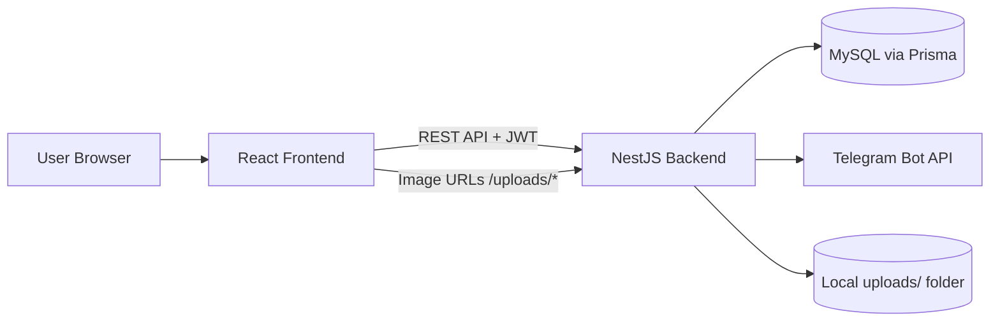

# Store Project Overview

## 1. What This Project Is

A full-stack store application with:

- Customer flow: register/login -> browse products -> add to cart -> checkout -> view orders
- Admin flow: manage categories/products, upload product images, update order status
- Notifications: send new order alerts to Telegram

Stack:

- Backend: NestJS + Prisma + MySQL (`src/`, `prisma/`)
- Frontend: React + Vite + Tailwind (`frontend/`)

## 2. System Diagram

## 3. Backend Architecture

Core app setup:

- Global validation pipe, CORS enabled, Prisma exception filter
- Swagger docs at `/docs`
- Serves uploaded files from `/uploads/*`
- Entry point: `src/main.ts`

Modules in `src/app.module.ts`:

- `AuthModule`
- `CategoriesModule`
- `ProductsModule`
- `CartModule`
- `OrdersModule`
- `UploadsModule`
- `PrismaModule`

Role model:

- `CUSTOMER`
- `ADMIN`

## 4. Database Model (Prisma)

Defined in `prisma/schema.prisma`:

- `User`
- `Category`
- `Product`
- `CartItem`
- `Order`
- `OrderItem`

Order shipping fields currently:

- `shippingName`
- `shippingPhone`
- `shippingStreet`
- `shippingHouse`
- `shippingCityProvince`
- `shippingDistrict`

## 5. API Endpoint Map

Legend:

- Public = no auth
- Customer = JWT + role CUSTOMER
- Admin = JWT + role ADMIN

### System

- `GET /` - Public - health/basic hello text
- `GET /docs` - Public - Swagger UI
- `GET /uploads/:filename` - Public - static uploaded files

### Auth (`src/auth`)

- `POST /auth/register` - Public - create user
  - Body: `email`, `password`, optional `role`
- `POST /auth/login` - Public - get JWT
  - Body: `email`, `password`
- `GET /auth/me` - Authenticated - returns JWT payload user info

### Categories (`src/modules/categories`)

- `GET /categories` - Public - list categories
- `GET /categories/:id` - Public - category details
- `POST /categories` - Admin - create category
- `PATCH /categories/:id` - Admin - rename category
- `DELETE /categories/:id` - Admin - delete category

### Products (`src/modules/products`)

- `GET /products` - Public - list products with filters
  - Query: `search`, `categoryId`, `page`, `limit`, `includeInactive`
- `GET /products/:id` - Public - product details
- `POST /products` - Admin - create product
- `PATCH /products/:id` - Admin - update product
- `DELETE /products/:id` - Admin - soft-disable product (`isActive=false`)

### Cart (`src/modules/cart`)

- `GET /cart` - Customer - get cart items + total
- `POST /cart/items` - Customer - add item
  - Body: `productId`, `quantity`
- `PATCH /cart/items/:productId` - Customer - change quantity
  - Body: `quantity`
- `DELETE /cart/items/:productId` - Customer - remove item

### Orders (`src/modules/orders`)

- `POST /orders` - Customer - create order from current cart
  - Body: `shippingName`, `shippingPhone`, `shippingStreet`, `shippingHouse`, `shippingCityProvince`, `shippingDistrict`
- `GET /orders` - Customer/Admin
  - Customer: own orders
  - Admin: all orders
- `PATCH /orders/:id/status` - Admin - update status (`PENDING|PAID|SHIPPED|COMPLETED|CANCELED`)

### Uploads (`src/modules/uploads`)

- `POST /upload` - Admin - upload image (`multipart/form-data`, field: `file`)
  - Uploads image to Cloudinary
  - Returns Cloudinary `secure_url`

## 6. Frontend Route Map

Defined in `frontend/src/App.tsx`:

- `/auth` - Login/Register page
- `/` - Products page
- `/products/:id` - Product detail
- `/cart` - Cart + checkout
- `/orders` - Customer orders list
- `/admin` - Admin dashboard

Route guard behavior:

- If not authenticated, protected pages redirect to `/auth`
- If authenticated, `/auth` redirects to `/`

## 7. Frontend Features Snapshot

- Responsive navbar with theme toggle and mobile menu (`frontend/src/components/Navbar.tsx`)
- Auth flow with token storage in `localStorage` (`store_token`)
- Product listing with filters, stock states, add-to-cart feedback (`frontend/src/pages/ProductsPage.tsx`)
- Product detail add-to-cart (`frontend/src/pages/ProductDetailPage.tsx`)
- Cart management + shipping checkout form (`frontend/src/pages/CartPage.tsx`)
- Orders history page (`frontend/src/pages/OrdersPage.tsx`)
- Admin tabs for categories/products/orders + image upload (`frontend/src/pages/AdminPage.tsx`)

## 8. Telegram Integration

In `src/modules/notifications/telegram.service.ts`:

- Trigger: after order creation
- Sends order summary to configured Telegram chat
- Controlled by:
  - `TELEGRAM_ENABLED`
  - `TELEGRAM_BOT_TOKEN`
  - `TELEGRAM_CHAT_ID`

## 9. Environment Variables In Use

Backend:

- `DATABASE_URL`
- `JWT_SECRET`
- `JWT_EXPIRES_IN`
- `TELEGRAM_ENABLED`
- `TELEGRAM_BOT_TOKEN`
- `TELEGRAM_CHAT_ID`
- `CLOUDINARY_CLOUD_NAME`
- `CLOUDINARY_API_KEY`
- `CLOUDINARY_API_SECRET`

Frontend:

- `VITE_API_BASE_URL`

## 10. Current Runtime/Deployment Notes

- Backend port is currently hardcoded to `3000` in `src/main.ts`
- CORS currently allows all origins (`app.enableCors()`)
- Uploads are local filesystem-based (`uploads/`), so production needs persistent storage
- Prisma migrations are in `prisma/migrations/`
- Seed script is in `prisma/seed.ts`

## 11. Test Coverage Snapshot

E2E tests in `test/store.e2e-spec.ts` cover:

- auth register/login
- admin category/product create
- customer add-to-cart and checkout
- admin list and update order status
